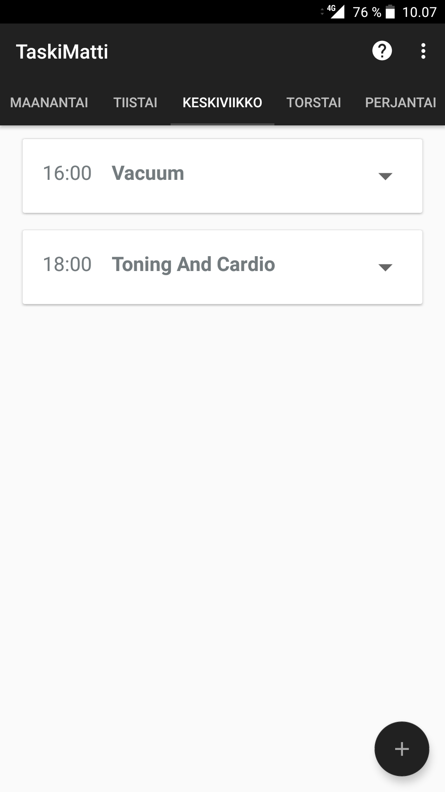
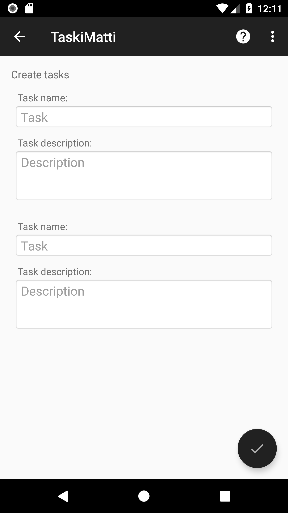
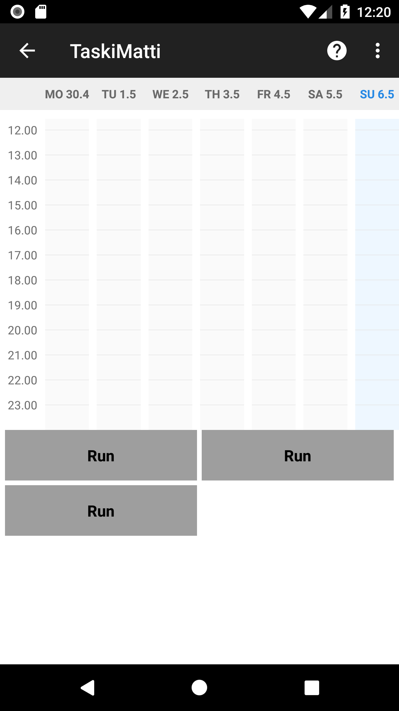
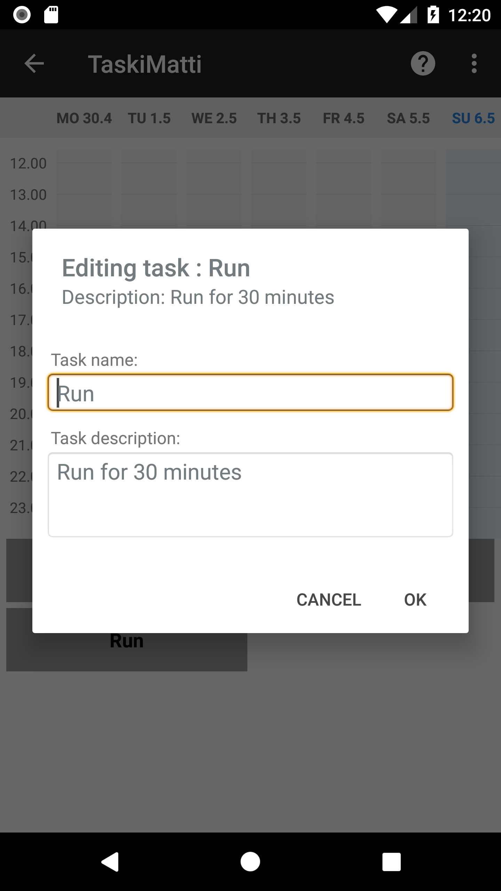
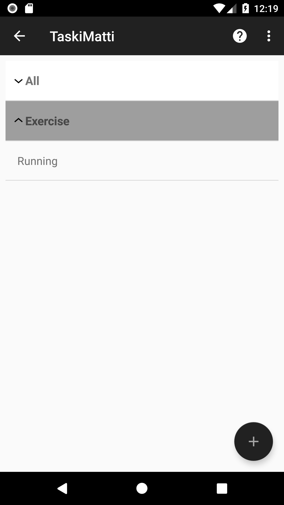
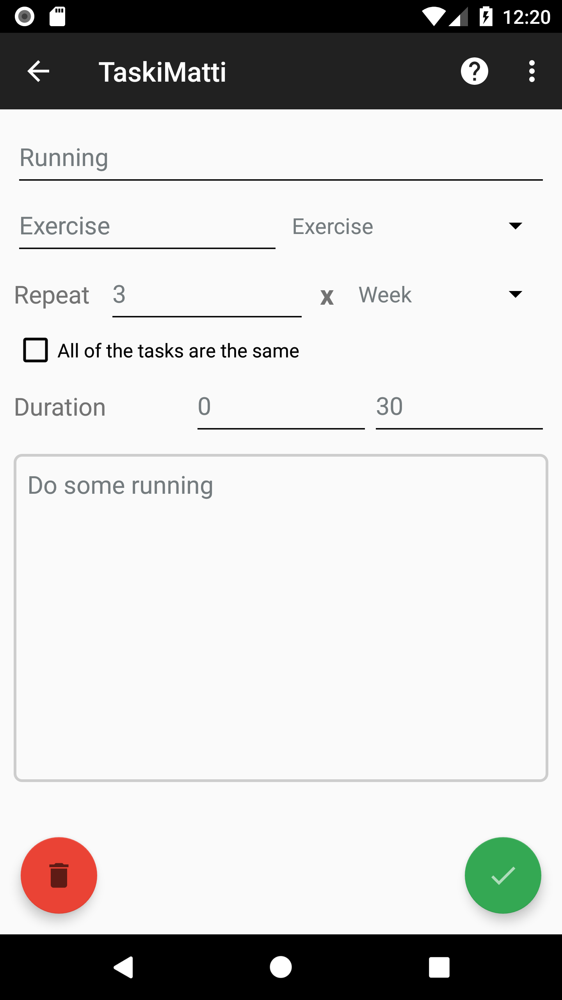
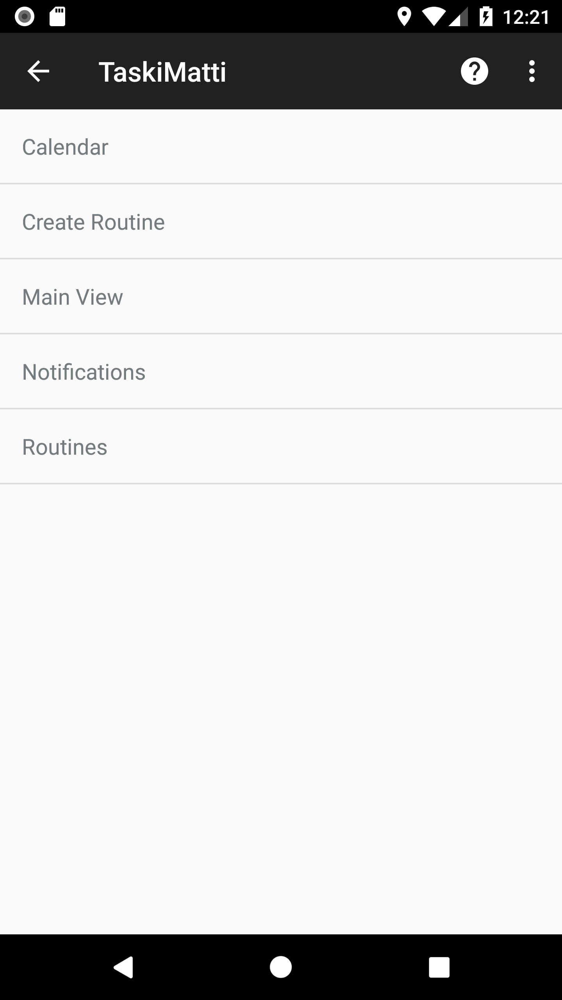

Created by: 
<a href="https://github.com/anttus">@anttus</a> 
<a href="https://github.com/MKotkav">@MKotkav</a> 
<a href="https://github.com/veetihelp">@veetihelp</a> 
<a href="https://github.com/jonikurk">@jonikurk</a> 

About the app: 
 ● Application for repetitive tasks that helps creating and maintaining new
routines
 ● Assists to remember rarely recurring events
 ● Motivates for active and organized lifestyle
 ● Offers a list of tasks created weekly, so the user can plan the next week’s
timetable
 &nbsp;&nbsp;&nbsp;&nbsp;○ Tasks can be assigned into the app's calendar
 ● Notifies the user when the task is due or when the user needs to set the next week's tasks

 
Login screen:  

	

 
Main view:  

	

 
Main view with task cards:  

	

 
Routine creation view:  

	

 
Task creation view:  

	

 
Calendar view:  

	

 
Task edit view (inside calendar view):  

	

 
Routines listing:  

	

 
Routine edit view (inside routines listing):  

	

 
Help menu:  

	

